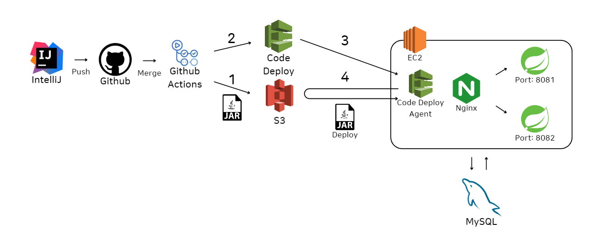

# 프로젝트: 로드메이커
## 모든 걸 스스로
한 달간 다시 만들어보기
서비스 설명
- MVP
## 1. 기술 스택
| **항목**          | **기술 스택**                                   |
|-----------------|---------------------------------------------|
| Language        | JAVA, SpringBoot                            |
| DB              | Redis, MySQL                                |
| CI/CD           | Github Actions, Code Deploy, S3, EC2, NginX |
| Static Analysis | Sonar Cloud                                 |
| IDE             | IntelliJ IDEA                               |
- Build: Gradle
- 초기 dependency: Spring Boot DevTools, Lombok, Spring Web, Spring Security, Spring Data JPA, Spring Data JDBC
## 2. 버전 정보
| **항목**      | **버전 정보** |
|-------------|-----------|
| JAVA        | v.17      |
| Spring Boot | v.3.1.3   |
## 3. Outline: 한 달간 구현된 것들
### 1. CI/CD 구축: Github Actions를 이용한 Blue/Green 배포
   - AWS 서비스 설정: Code Deploy, EC2 등 연동
   - Code Deploy를 이용한 코드 배포
   - NginX: 리버스 프록시

### 2. DB 설정 및 연결: MySQL & Redis
### 3. 기능 구현
   - 로그인, 회원 가입: JWT token, Spring Security
   - GPT API 이용한 로드맵 생성: 스레드 풀을 이용한 멀티스레드 api 호출
   - 블로그 인증
   - 게시글 검색
   - 댓글
### 4. 섬네일 이미지 최적화
   - Spring Boot와 AWS S3 연동: 온디맨드 리사이징
